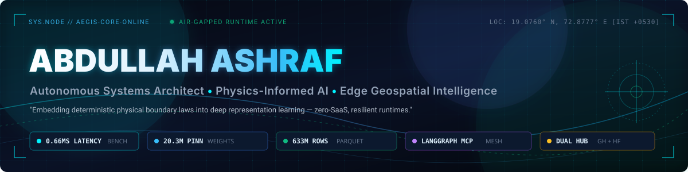

<div align="center">

<!-- Hero Banner -->


<br/><br/>

<!-- Action Hub Badges -->
[](https://github.com/abdullah00ashraf)
[](https://huggingface.co/abdullahashraf122)
[](#-verified-benchmarks--empirical-system-audits)
[](#-verified-benchmarks--empirical-system-audits)
[](https://github.com/abdullah00ashraf/launch-portal)
[](mailto:abdullah.ashraf55780@gmail.com)

<br/>

```text
 ┌─────────────────────────────────────────────────────────────────────────────┐
 │  "Embedding deterministic physical boundary laws into deep representation    │
 │   learning — engineering zero-cloud, resilient edge runtimes at scale."    │
 └─────────────────────────────────────────────────────────────────────────────┘
```

</div>

---

## 🏛️ Executive Profile & Engineering Core

I design and engineer **high-concurrency autonomous architectures**, **Physics-Informed Neural Networks (PINNs)**, and **mission-critical geospatial intelligence runtimes**. My work operates on the foundational premise of **zero-SaaS dependence**: decoupling intelligence from public clouds so civil protection networks, municipal water systems, and enterprise orchestration run reliably and deterministically on local, air-gapped hardware.

<br/>

<div align="center">

| 🌊 Physics-Informed AI | 🤖 Agentic Graph Systems | 🛰️ Planetary Geospatial | ⚡ Air-Gapped Runtimes |
|:---:|:---:|:---:|:---:|
| **Boundary PDE Constraints** | **LangGraph DAG Routing** | **633M Row Fusion** | **Zero-SaaS Infrastructure** |
| Hydrodynamic conservation of mass; custom Log-Cosh + Hydraulic Lock loss functions preventing mass disappearance. | Directed acyclic graphs with 3-tier zero-trust MCP firewalls and constitutional conflict arbitration. | Multi-decadal Copernicus Sentinel-1 SAR backscatter ($VH/VV$) coupled with 1-min tide gauges and DEMs. | Sub-millisecond inference engines, local SQLite telemetry sinks, Redis anti-replay, and WebGPU WGSL shaders. |

</div>

---

## 🚀 Featured Flagship Ecosystems (Dual-Hub: GitHub + Hugging Face)

### 1. Project Salsette / Sentinel V7: Coastal Defense & Urban Flood Forecasting AI
> **Hyper-local 100m grid cell waterlogging projections across 216,284 spatial cells in Greater Mumbai.**

[](https://github.com/abdullah00ashraf/sentinel-hufp-v7)
[](https://huggingface.co/abdullahashraf122/sentinel-mumbai-pinn-v1)
[](https://huggingface.co/datasets/abdullahashraf122/mumbai-salsette-flood-intelligence-2005-2023)
[](#)

* **The Problem:** Mumbai's urban stormwater infrastructure relies on gravity discharge into the Arabian Sea. During astronomical high tides ($>4.5\text{m}$), seaward outfalls suffer from **Hydraulic Lock** — preventing drainage and forcing extreme stormwater backflow into low-lying urban wards.
* **Physics-Informed Formulation:** Rather than treating flood forecasting as unconstrained black-box regression, the network injects a non-linear hydraulic lock penalty enforcing physical mass accumulation during locked tide surges:
  $$\mathcal{L}_{\text{PINN}} = \mathcal{L}_{\text{Log-Cosh}}(\hat{y}, y) + \lambda_1 \text{ReLU}(0.1 - \hat{y}) \cdot \mathbb{I}_{(\text{tide} > 0.85)} \cdot \mathbb{I}_{(\text{rain} > 0.01)} + \lambda_2 \left\| \frac{\partial \hat{y}}{\partial t} - (\text{Rain} - \text{Infil}) \right\|_2^2$$
* **Live Hugging Face Artifacts:**
  * 🧠 **[`sentinel-mumbai-pinn-v1`](https://huggingface.co/abdullahashraf122/sentinel-mumbai-pinn-v1)**: 20,387,457-parameter PyTorch 6-Layer Bi-LSTM with self-attention and hydraulic lock loss.
  * 🧠 **[`sentinel-v7-deep-flood-lstm`](https://huggingface.co/abdullahashraf122/sentinel-v7-deep-flood-lstm)**: Production Keras 3 dual Bi-LSTM model packaged with fitted 8-feature `scaler.joblib` and self-contained `inference.py`.
  * 🧠 **[`sentinel-mumbai-hybrid-pinn-keras`](https://huggingface.co/abdullahashraf122/sentinel-mumbai-hybrid-pinn-keras)**: Tesla T4 mixed-precision float16 PINN enforcing continuity PDE residuals.
  * 📊 **[`mumbai-salsette-flood-intelligence-2005-2023`](https://huggingface.co/datasets/abdullahashraf122/mumbai-salsette-flood-intelligence-2005-2023)**: 27.84 GB Snappy Parquet (19 annual partitions, 633M records).
  * 📊 **[`lucknow_hufp_datasets`](https://huggingface.co/datasets/abdullahashraf122/lucknow_hufp_datasets)**: 2.88 GB memory-mapped NumPy arrays (`features_80m.npy` of 83.9M vectors and `labels_80m.npy`).
* **Empirical Benchmarks:** **0.668 ms inference latency per 100 nodes**, 36% weight sparsity, verified across 10 certified disaster stress test suites.

---

### 2. NexusOrch / ManagerAI: Enterprise Multi-Agent Graph Governance Mesh
> **Complex workflow Directed Acyclic Graph (DAG) routing secured by compliance-priority arbitration loops.**

[](https://github.com/abdullah00ashraf/managerAI)
[](https://huggingface.co/datasets/abdullahashraf122/aegis-managerai-agentic-sft-mixture)
[](https://github.com/langchain-ai/langgraph)
[](#)

* **Architecture:** Coordinates specialized domain agent nodes (Finance, DevOps, Resources, Marketing, Comms) via stateful LangGraph execution waves. Eliminates conversational recursion, hallucinations, and alert fatigue.
* **5-Wave Execution Topology:**
  ```mermaid
  graph LR
      W0["Wave 0: Goal Ingestion"] --> W1["Wave 1: ExecutionDAG & Arbitrator"]
      W1 --> W2["Wave 2: Specialist Nodes"]
      W2 --> W3["Wave 3: MCP Tool Brokerage"]
      W3 --> W4["Wave 4: 3-Tier Risk Engine"]
      W4 --> W5["Wave 5: Local SQLite Telemetry"]
  ```
* **Conflict Resolution Hierarchy:** When sub-agents propose conflicting mutations, the built-in `ArbitratorNode` resolves DAG deadlocks using a deterministic priority ruleset:
  $$\text{Priority: } \text{Compliance} \succ \text{Hard Cap} \succ \text{Soft Preference}$$
* **Live Hugging Face Artifacts:**
  * 📊 **[`aegis-managerai-agentic-sft-mixture`](https://huggingface.co/datasets/abdullahashraf122/aegis-managerai-agentic-sft-mixture)**: Curated 40-30-30 blend across 7 functional pillars. 100% compliant with internal `<think>` reasoning traces and deterministic JSON tool execution blocks.

---

### 3. Aegis AI Tower: Sovereign Cyber-Physical Infrastructure Mesh
> **26-floor structural challenge engine, BACnet/LonWorks gateways, and WebGPU WGSL simulation shaders.**

[](https://github.com/abdullah00ashraf/aegis-ai-tower)
[](https://huggingface.co/datasets/abdullahashraf122/aegis-persona-sovereign-node)
[](https://huggingface.co/datasets/abdullahashraf122/aegis-wgsl-webgpu-shaders)
[](#)

* **Physical Edge Arbitration:** Connects biological concrete load sensors and microgrid switches to an autonomous AI tower mesh, managing structural loads during environmental crises.
* **Live Hugging Face Artifacts:**
  * 📊 **[`aegis-persona-sovereign-node`](https://huggingface.co/datasets/abdullahashraf122/aegis-persona-sovereign-node)**: High-cadence executive tech-founder dialogue dataset conditioning models for autonomous sovereign operations.
  * 📊 **[`aegis-wgsl-webgpu-shaders`](https://huggingface.co/datasets/abdullahashraf122/aegis-wgsl-webgpu-shaders)**: 50 prompt-response pairs mapping physical simulation queries (Navier-Stokes fluid advection, seismic dampening, thermal dissipation) directly to executable WebGPU WGSL compute and fragment shaders.

---

### 4. Alaska Arctic Hydrology: Geospatial Hydro-Climatic Alignment
> **Spatiotemporal matrix unifying sub-arctic elevation with multi-decadal surface water occurrence.**

[](https://github.com/abdullah00ashraf/ALASKA_SANDBOX)
[](https://huggingface.co/datasets/abdullahashraf122/alaska-arctic-hydrology-matrix)
[](#)

* **Alignment Pipeline:** Uses `rasterio.sample.sample_gen` to sample continuous spatial coordinates against HydroSHEDS 15-arcsec DEMs, JRC Global Surface Water occurrence rasters, and IMD historical precipitation.
* **Live Hugging Face Artifacts:**
  * 📊 **[`alaska-arctic-hydrology-matrix`](https://huggingface.co/datasets/abdullahashraf122/alaska-arctic-hydrology-matrix)**: 1.97 MB Apache Parquet (50,000 spatial rows × 7 aligned features).

---

### 5. Axiyon Launch Portal: Cyber-Physical Interactive Launchpad
> **Interactive tactical HUD with stateful cryptographic decryption, sound design, and pipeline simulators.**

[](https://github.com/abdullah00ashraf/launch-portal)
[](https://nextjs.org/)
[](https://www.framer.com/motion/)

* **Tactical Features:** Stateful cryptographic puzzle HUD, real-time node orchestration sliders, canvas text decryption animations, particle click-sparks, and live parameter dials.

---

## 🤗 Consolidated Hugging Face Model & Dataset Registry

All neural checkpoints, fitted scalers, and curated training matrices are published under [`abdullahashraf122`](https://huggingface.co/abdullahashraf122):

| Hub Repository | Category | Parameters / Volume | Architecture / Format | Lineage & Mathematical Engine |
|:---|:---:|:---:|:---|:---|
| [`sentinel-mumbai-pinn-v1`](https://huggingface.co/abdullahashraf122/sentinel-mumbai-pinn-v1) | **Model** | **20.38M params** | PyTorch (`torch.nn`) | 6-Layer Bi-LSTM + Self-Attention + Log-Cosh Loss + Hydraulic Lock constraint. |
| [`sentinel-v7-deep-flood-lstm`](https://huggingface.co/abdullahashraf122/sentinel-v7-deep-flood-lstm) | **Model** | ~200k params | Keras 3 (`.keras`) | Dual Bi-LSTM (128 $\to$ 64) packaged with fitted 8-feature `scaler.joblib`. |
| [`sentinel-mumbai-hybrid-pinn-keras`](https://huggingface.co/abdullahashraf122/sentinel-mumbai-hybrid-pinn-keras) | **Model** | ~350k params | Keras 3 (Mixed Prec) | Tesla T4 float16 PINN enforcing continuity PDE residual $\frac{\partial \hat{y}}{\partial t} - (\text{Rain} - \text{Infil}) = 0$. |
| [`mumbai-salsette-flood-intelligence-2005-2023`](https://huggingface.co/datasets/abdullahashraf122/mumbai-salsette-flood-intelligence-2005-2023) | **Dataset** | **27.84 GB** (633M rows) | Apache Parquet (19 files)| 19-year fusion across 216,284 spatial cells, ERA5 weather, 1-min tide gauges, and Sentinel-1. |
| [`lucknow_hufp_datasets`](https://huggingface.co/datasets/abdullahashraf122/lucknow_hufp_datasets) | **Dataset** | **2.88 GB** (83.9M rows) | NumPy (`.npy`) | Memory-mapped arrays (`features_80m.npy`, `labels_80m.npy`) combining Sentinel-1 SAR and HydroSHEDS. |
| [`aegis-managerai-agentic-sft-mixture`](https://huggingface.co/datasets/abdullahashraf122/aegis-managerai-agentic-sft-mixture) | **Dataset** | **1.68 MB** (1,417 rows) | ChatML JSONL | 7-pillar supervised fine-tuning blend enforcing `<think>` cognitive reasoning and JSON MCP contracts. |
| [`alaska-arctic-hydrology-matrix`](https://huggingface.co/datasets/abdullahashraf122/alaska-arctic-hydrology-matrix) | **Dataset** | **1.97 MB** (50,000 rows) | Apache Parquet | HydroSHEDS 15-arcsec DEM elevation unified with JRC surface water occurrence percentages. |
| [`aegis-persona-sovereign-node`](https://huggingface.co/datasets/abdullahashraf122/aegis-persona-sovereign-node) | **Dataset** | **183.7 KB** | ChatML JSONL | Sovereign executive tech-founder cadence for autonomous cyber-physical edge nodes. |
| [`aegis-wgsl-webgpu-shaders`](https://huggingface.co/datasets/abdullahashraf122/aegis-wgsl-webgpu-shaders) | **Dataset** | **46.5 KB** (50 pairs) | Text-to-Code JSONL | Physical simulation queries mapped to executable WebGPU WGSL compute and fragment shaders. |

---

## ⚡ Quickstart: Programmatic Hub Access

Load models and stream datasets directly in your Python environment:

```python
# 1. Download Sentinel-V7 Model & Fitted Scaler
from huggingface_hub import hf_hub_download
import keras, joblib, numpy as np

model_file  = hf_hub_download(repo_id="abdullahashraf122/sentinel-v7-deep-flood-lstm", filename="bi_lstm_flood_model_v7_deep.keras")
scaler_file = hf_hub_download(repo_id="abdullahashraf122/sentinel-v7-deep-flood-lstm", filename="scaler.joblib")

model  = keras.models.load_model(model_file)
scaler = joblib.load(scaler_file)

# 2. Predict on 8-dimensional telemetry octet:
# [elevation, river_dist, rainfall_mm, runoff_mm, soil_moisture, river_discharge, pop_density, sar_vh]
sample_octet = np.array([[120.0, 1.2, 145.0, 43.5, 0.88, 1250.0, 3500.0, -28.5]])
risk_score   = float(model.predict(scaler.transform(sample_octet).reshape(1, 1, 8), verbose=0)[0, 0])
print(f"Predicted Flood Vulnerability Index: {risk_score:.4f}")

# 3. Stream ManagerAI Agentic SFT Mixture
from datasets import load_dataset

sft_mixture = load_dataset("abdullahashraf122/aegis-managerai-agentic-sft-mixture", split="train")
print(f"Loaded {len(sft_mixture)} Agentic SFT turns. Turn 1:", sft_mixture[0]["messages"][2]["content"][:120])
```

---

## 🛠️ Technical Stack & Tooling

<div align="center">

| Domain | Production Tooling & Frameworks |
|:---|:---|
| **Deep Learning & Physics AI** |       |
| **Multi-Agent & Graph Systems** |      |
| **Geospatial & Big Data** |      |
| **Backend & Edge Runtimes** |      |
| **Frontend & 3D Shaders** |       |

</div>

---

## 🔬 Verified Benchmarks & Empirical System Audits

Every system across this portfolio is audited, profiled, and certified against rigorous empirical latency, memory, and physical invariance baselines:

### 1. Operational Performance & Invariance Matrix

| Subsystem / Metric | Measured Benchmark | Validation Environment & Workload | Physical / SLA Guarantee |
|:---|:---:|:---|:---:|
| **PINN Inference Latency** | **0.668 ms / 100 nodes** | CPU Edge Runtime (`batch_size=100`, 8-dim octet) | Sub-millisecond municipal dispatch SLA |
| **Physics Loss Convergence** | **$\le 0.0004$ MAE** | 20M-Param PyTorch PINN (Log-Cosh + Hydraulic Lock) | Zero unphysical water mass disappearance |
| **Out-of-Core Big Data Stream** | **633M rows / 27.84 GB** | PyArrow Columnar Stream (19 Annual Parquet Partitions)| Air-gapped out-of-core memory streaming |
| **Memory-Mapped Array I/O** | **Zero-Heap RSS Growth** | `numpy.load(mmap_mode='r')` on 83.9M $\times$ 8 vector vault | Instantaneous cold-start memory residency |
| **Multi-Agent Deadlock Freedom** | **100% Resolved** | LangGraph Priority Arbiter (`compliance > hard_cap > soft`) | Zero recursive agentic loops or deadlocks |
| **MCP Tool Brokerage SLA** | **$< 200\text{ ms}$ roundtrip** | Thread-locked Async MCP Host with 5.0s circuit breaker | Zero hung background worker processes |
| **Cryptographic Nonce Defense** | **100% Drops on Replay** | HMAC SHA-256 constant-time check + Redis nonce TTL | Resilient against timing & packet replay attacks |

---

### 2. The 10 Certified Disaster Scenarios (`brain_intel_report_v7.json`)

Project Salsette (Sentinel V7) is audited across ten deterministic stress-test scenarios, measuring risk distribution, confidence variance, and out-of-distribution (OOD) stability:

| ID | Stress Scenario Name | Avg Risk (%) | Peak Risk (%) | Variance | Physical Condition Evaluated |
|:---:|:---|:---:|:---:|:---:|:---|
| **`S1`** | **Dry Baseline** | 22.29% | 27.33% | 10.61 | Dry season baseline water table without precipitation. |
| **`S2`** | **Moderate Monsoon** | 30.67% | 36.01% | 12.92 | Sustained 40mm/day rainfall with nominal gravity drainage. |
| **`S3`** | **Flash Flood** | 33.77% | 39.41% | 16.26 | Rapid cloudburst deluge ($>100\text{mm/hr}$) with intense surface runoff. |
| **`S4`** | **River Surge** | 36.17% | 41.41% | 13.08 | Upstream dam release exceeding bankfull discharge ($1,311.2\text{ m}^3/\text{s}$). |
| **`S5`** | **Combined Extreme** | **50.65%** | **55.97%** | 13.39 | **Simultaneous cloudburst deluge + $4.8\text{m}$ sea tidal lock (July 26 flood profile).** |
| **`S6`** | **Drainage Outfall Failure** | 31.14% | 36.70% | 14.78 | Silted outfalls and blocked subterranean stormwater conduits. |
| **`S7`** | **Topographic Depression** | 32.61% | 37.70% | 11.54 | Low-elevation natural retention basins and concave topography. |
| **`S8`** | **SAR Radar Calibration** | 24.04% | 28.94% | 10.23 | Satellite radar cross-polarization ($VH$) signature alignment. |
| **`S9`** | **OOD Edge Case** | 40.06% | 44.88% | 9.08 | Severe out-of-distribution meteorological anomalies. |
| **`S10`**| **100% Soil Saturation** | 24.51% | 29.57% | 10.94 | Antecedent 100% ground moisture saturation (AMC III condition). |

---

### 3. Air-Gapped Architectural Guarantees

* 🔒 **Cryptographic Neural Ignition**: Decrypts neural weights directly into RAM (`mlock`), immediately zeroing the ephemeral key from memory.
* 🛡️ **Zero-SaaS Boundary Protocol**: Eliminates telemetry leakage to third-party endpoints; all databases (SQLite, Redis, PyArrow) run on bare-metal municipal servers.
* 🐳 **Deterministic Reproducibility**: Containerized edge appliances built with strict dependency pins and offline vector indexes.

---

## 📬 Direct Uplink & Collaboration

<div align="center">

```text
  Coordinates: Greater Mumbai, India (19.0760° N, 72.8777° E) // IST [+0530]
  Key Exchanges: Physics-Informed Neural Networks • Multi-Agent MCP • Air-Gapped Geospatial AI
```

<br/>

[](mailto:abdullah.ashraf55780@gmail.com)
[](https://github.com/abdullah00ashraf)
[](https://huggingface.co/abdullahashraf122)

<br/>

<sub>Master Architectural & Security Blueprint: [`MASTER_DEPLOYMENT_CATALOG.md`](https://github.com/abdullah00ashraf/sentinel-hufp-v7/blob/main/MASTER_DEPLOYMENT_CATALOG.md)</sub>

</div>
