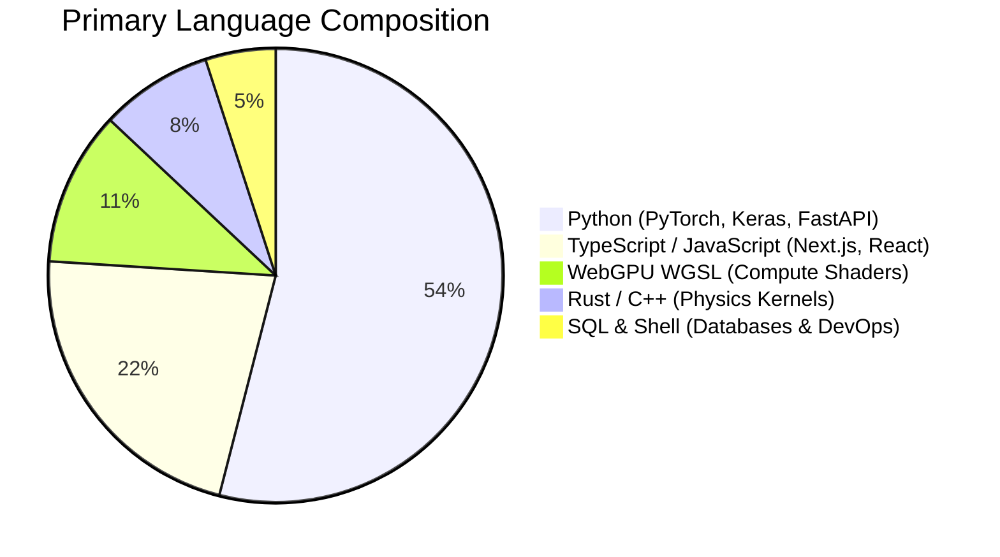

<div align="center">

<!-- AI Models & Code Architecture Header Banner -->


<br/><br/>

<!-- Executive Identity -->
<h1 align="center" style="border-bottom: none; font-size: 34px; margin-bottom: 2px;">Abdullah Ashraf</h1>

<p align="center" style="font-size: 16px; margin-top: 0; margin-bottom: 14px; color: #79c0ff;">
  <b>Autonomous Systems Architect &nbsp;&bull;&nbsp; Deep Learning & Geospatial Intelligence &nbsp;&bull;&nbsp; Systems Engineer</b>
</p>

<!-- Location, Timezone & Deployment Badges -->
<p align="center" style="margin-top: 0; margin-bottom: 20px;">
  <a href="https://www.google.com/maps/place/Lucknow,+Uttar+Pradesh,+India"></a>
  &nbsp;
  
  &nbsp;
  
  &nbsp;
  
  &nbsp;
  
</p>

<!-- Symmetrical, High-Impact Action Badges -->
<p align="center">
  <a href="https://abdullahashraf.pythonanywhere.com/" target="_blank">
    
  </a>
  &nbsp;
  <a href="https://www.linkedin.com/in/abdullah-ashraf-0656aa2a4/" target="_blank">
    
  </a>
  &nbsp;
  <a href="https://github.com/abdullah00ashraf" target="_blank">
    
  </a>
  &nbsp;
  <a href="https://huggingface.co/abdullahashraf122" target="_blank">
    
  </a>
  &nbsp;
  <a href="mailto:abdullah.ashraf55780@gmail.com">
    
  </a>
</p>

</div>

<br/>

> [!NOTE]
> ### 📋 Executive Engineering Briefing
> Systems and Deep Learning Engineer specializing in **Physics-Informed Neural Networks (PINNs)**, **Multi-Agent Directed Acyclic Graph (DAG) Governance (LangGraph / MCP 2.0)**, and **Zero-SaaS air-gapped geospatial intelligence runtimes**. Author of production spatiotemporal big-data pipelines (**633M records** across 27.8 GB Parquet), custom **WebGPU simulation shaders**, and sub-millisecond edge neural inference engines (**0.668 ms / 100 Nodes**).

---

## 🛠️ Languages, Tools & Technical Arsenal

### 📊 Codebase Language Distribution



<div align="center">
  
</div>

<br/>

### 🧰 Tools & Infrastructure Stack

| Domain | Core Tools & Platforms | Operational Responsibility |
|:---|:---|:---|
| **Deep Learning & Modeling** | `PyTorch` `TensorFlow` `Keras 3` `Hugging Face Hub` `Scikit-Learn` `SHAP` `LIME` | Physics-informed loss manifolds, neural training, model versioning |
| **Agentic & Graph Systems** | `LangGraph` `Model Context Protocol (MCP 2.0)` `Pydantic v2` `NetworkX` | Multi-agent DAG routing, thread-locked tool brokerage, schema typing |
| **Geospatial & Big Data** | `GDAL` `Rasterio` `Apache Parquet` `PyArrow` `Xarray` `NetCDF4` `Sentinel-1 SAR` | Spatial DEM sampling, 27.8 GB columnar streams, radar calibration |
| **Backend & Edge Runtimes** | `FastAPI` `Uvicorn` `Redis` `SQLite` `Docker` `HMAC SHA-256` | Async REST endpoints, anti-replay nonces, air-gapped appliances |
| **Frontend & Visualization** | `Next.js 14` `React 19` `Tailwind CSS 4` `Three.js` `Framer Motion` `WebGPU` | Cyberpunk tactical HUDs, particle clouds, canvas decryption |
| **DevOps & Environment** | `Git` `Git LFS` `VS Code` `UV` `Poetry` `Pip` `PowerShell` `Bash` | Reproducible dependency environments, large binary tracking |

<br/>

### 1. Programming Languages
* **Python 3.12+** — *Advanced*: PyTorch, Keras 3, AsyncIO, FastAPI, NumPy, Pandas, PyArrow, SciPy, Numba, Poetry, UV
* **Rust** — *Systems & Numerical Simulation*: Safe memory structures, PyO3 memory bridges, C++ bindings
* **TypeScript / JavaScript** — *Full-Stack & Graphics*: Next.js 14 App Router, React 19, Node.js, Three.js, Canvas API
* **WebGPU WGSL** — *High-Performance Shaders*: Compute & fragment pipelines, numerical fluid simulation, parallel workgroups
* **SQL** — *Data Engines*: PostgreSQL, SQLite embedded telemetry sinks, complex window aggregations
* **Shell / Scripting** — *Automation & DevOps*: PowerShell, POSIX Bash, Dockerfile orchestration

### 2. Deep Learning, AI & Mathematics
* **Frameworks**: PyTorch (`torch.nn`, Custom Autograd, Multi-Head Attention), Keras 3 (TensorFlow backend, mixed-precision float16)
* **Paradigms**: Physics-Informed Neural Networks (PINNs), Partial Differential Equation (PDE) residual optimization, Bi-Directional LSTMs
* **Loss Manifolds**: Log-Cosh loss optimization, Hydraulic Lock mass conservation constraints, Huber loss
* **Explainable AI (XAI)**: SHAP (SHapley Additive exPlanations), LIME feature attribution matrices
* **Data & Models Hub**: Hugging Face Hub API (`huggingface_hub`, Git LFS, Datasets, Model Cards, Data Cards)
* **Optimization & Data Science**: Scikit-Learn (Pipelines, MinMaxScaler, Metrics), Joblib, NetworkX (DAGs)

### 3. Multi-Agent Systems & Distributed Protocols
* **Orchestration**: LangGraph (Stateful cyclic & directed acyclic graphs, wave execution, checkpointing)
* **Protocols**: Model Context Protocol (MCP 2.0), Tool Brokerage, Asynchronous Concurrency Locks
* **Contracts & Typing**: Pydantic v2 (Strict BaseModel serialization, runtime validation)
* **Alignment & Governance**: Constitutional AI (Anthropic HHH guardrails), Priority Conflict Arbitrators (`compliance > hard_cap > soft_preference`)

### 4. Geospatial, Remote Sensing & Big Data
* **GIS Libraries**: GDAL / OGR, Rasterio (Affine transformations, sub-pixel raster sampling), Xarray, NetCDF4
* **Columnar Big Data**: Apache Arrow / PyArrow, Apache Parquet (Snappy compression, out-of-core partitions)
* **Satellite Earth Observation**: Copernicus Sentinel-1 Synthetic Aperture Radar (SAR IW GRD $VH/VV$ backscatter)
* **Topographic & Hydro Data**: HydroSHEDS 15-arcsec DEM, JRC Global Surface Water, NASA DEM, GEOGloWS river flow, MCGM 1-min tide gauges

### 5. Backend, Edge Runtimes & Security
* **Web Frameworks**: FastAPI (Asynchronous ASGI endpoints, WebSockets, streaming responses), Uvicorn
* **Caching & Nonces**: Redis (Anti-replay nonce vaults, time-to-live keys, sliding-window rate limiting)
* **Security & Cryptography**: Constant-time HMAC SHA-256 verifiers, AES-GCM encryption, RAM locking (`mlock`), zero plaintext secrets
* **Containerization & Observability**: Docker, Air-Gapped Appliances, Local SQLite OpenTelemetry (OTEL) trace span collector

### 6. Frontend & Visual Interfaces
* **Web Framework**: Next.js 14 (App Router, Server Actions, React 19)
* **Styling**: Tailwind CSS 4.0, CSS Grid, Custom Design Tokens
* **Motion & 3D**: Three.js (WebGL particle fields, geometry buffers), Framer Motion (Hardware-accelerated reactive animations)

---

## 📦 What We Have Built: Production Systems & Repositories

### 🌊 [Project Salsette / Sentinel V7](https://github.com/abdullah00ashraf/sentinel-hufp-v7) — Coastal Defense & Flood Forecasting AI
* **Overview**: Air-gapped municipal disaster response runtime delivering hyper-local 100m grid cell waterlogging projections over 216,284 spatial cells across Greater Mumbai.
* **Technical Highlights**:
  * **20.3M-Parameter PyTorch PINN**: 6-Layer Bi-LSTM with self-attention optimizing a custom **Log-Cosh + Hydraulic Lock** mass conservation penalty to prevent unphysical water disappearance during sea surges.
  * **Keras 3 Mixed-Precision PINN**: Attention-augmented network enforcing continuity PDE residuals $\frac{\partial \hat{y}}{\partial t} - (\text{Rain} - \text{Infil}) = 0$.
  * **27.84 GB Multi-Decadal Parquet Vault**: Fuses 19 years (2005–2023, 633M records) of Sentinel-1 SAR, ERA5 weather, and 1-minute tide gauges.
  * **0.668 ms Inference Latency**: Sub-millisecond execution per 100 geospatial nodes certified across 10 deterministic disaster stress scenarios.
* **Artifacts**: [Sentinel V7 Model Repo](https://github.com/abdullah00ashraf/sentinel-hufp-v7) &nbsp;•&nbsp; [Mumbai Operations Runtime Repo](https://github.com/abdullah00ashraf/MUMBAI_mlc) &nbsp;•&nbsp; [🤗 PyTorch PINN Model](https://huggingface.co/abdullahashraf122/sentinel-mumbai-pinn-v1) &nbsp;•&nbsp; [🤗 Keras Sequence Model](https://huggingface.co/abdullahashraf122/sentinel-v7-deep-flood-lstm) &nbsp;•&nbsp; [📊 27.8 GB Parquet Dataset](https://huggingface.co/datasets/abdullahashraf122/mumbai-salsette-flood-intelligence-2005-2023) &nbsp;•&nbsp; [📊 83.9M Vector NumPy Vault](https://huggingface.co/datasets/abdullahashraf122/lucknow_hufp_datasets)

---

### 🤖 [NexusOrch / ManagerAI](https://github.com/abdullah00ashraf/managerAI) — Enterprise Multi-Agent Graph Governance Mesh
* **Overview**: Autonomous enterprise orchestration platform coordinating specialized LLM nodes (Finance, DevOps, Resources, Comms) via LangGraph Directed Acyclic Graphs.
* **Technical Highlights**:
  * **5-Wave Execution Topology**: Decouples cognitive planning from tool execution with a thread-locked Model Context Protocol (MCP 2.0) host.
  * **Arbitrator Circuit Breaker**: Deterministic priority conflict resolution (`compliance > hard_cap > soft_preference`) eliminating recursive conversational loops and deadlocks.
  * **1,417-Turn Augmented ChatML SFT Mixture**: 7-pillar supervised fine-tuning dataset built and validated in-house, enforcing internal `<think>` reasoning traces and deterministic JSON tool calls.
  * **Zero-SaaS Telemetry**: Local SQLite OpenTelemetry sink logging sub-millisecond execution spans without external cloud dependencies.
* **Artifacts**: [GitHub Repo](https://github.com/abdullah00ashraf/managerAI) &nbsp;•&nbsp; [📊 Augmented ChatML SFT Dataset](https://huggingface.co/datasets/abdullahashraf122/aegis-managerai-agentic-sft-mixture)

---

### 🏛️ [Aegis AI Tower](https://github.com/abdullah00ashraf/aegis-ai-tower) — Sovereign Cyber-Physical Defense & Edge Shaders
* **Overview**: Sovereign cyber-physical infrastructure mesh managing real-time building arbitration, edge sensor networks, and interactive WebGPU physical simulations.
* **Technical Highlights**:
  * **WebGPU WGSL Shader Suite**: 50 prompt-response pairs compiling natural language simulation queries directly into executable WebGPU compute and fragment shaders (Navier-Stokes fluid advection, seismic dissipation, acoustic damping).
  * **Sovereign Persona Dataset**: 183 KB ChatML technical dialogue conditioning autonomous models with high-cadence executive engineering cadence.
  * **Full-Stack HUD**: React 19, Three.js canvas particle clouds, and Tailwind CSS 4.
* **Artifacts**: [GitHub Repo](https://github.com/abdullah00ashraf/aegis-ai-tower) &nbsp;•&nbsp; [📊 Sovereign Persona Dataset](https://huggingface.co/datasets/abdullahashraf122/aegis-persona-sovereign-node) &nbsp;•&nbsp; [📊 WGSL Shaders Dataset](https://huggingface.co/datasets/abdullahashraf122/aegis-wgsl-webgpu-shaders)

---

### 🛰️ [Alaska Arctic Hydrology](https://github.com/abdullah00ashraf/ALASKA_SANDBOX) — Sub-Arctic Hydro-Climatic Alignment
* **Overview**: High-throughput geospatial pipeline harmonizing continental digital elevation models with satellite surface water occurrence.
* **Technical Highlights**:
  * **Spatial Alignment Engine**: Sub-pixel extraction aligning HydroSHEDS 15-arcsec DEMs with JRC Global Surface Water occurrence percentages and IMD precipitation.
  * **50k-Point Feature Matrix**: Compiled into an optimized 1.97 MB Apache Parquet matrix for instant streaming.
* **Artifacts**: [GitHub Repo](https://github.com/abdullah00ashraf/ALASKA_SANDBOX) &nbsp;•&nbsp; [📊 50k Parquet Matrix](https://huggingface.co/datasets/abdullahashraf122/alaska-arctic-hydrology-matrix)

---

### 🚀 [Axiyon Launch Portal](https://github.com/abdullah00ashraf/launch-portal) — Cyber-Physical Interactive Launchpad
* **Overview**: Interactive cyberpunk-styled tactical operations center and deployment HUD built with Next.js 14 and Framer Motion.
* **Technical Highlights**:
  * **Interactive Tactical Dials**: Real-time parameter sliders (rainfall intensity, tidal surge meters, solver stress thresholds) driving dynamic frontend risk calculations.
  * **Stateful Cryptographic HUD**: Canvas text-scrambling decryption animations and zero-latency terminal log simulation.
* **Artifacts**: [GitHub Repo](https://github.com/abdullah00ashraf/launch-portal)

---

### 🌐 [Protofolio Showcase & Gateway](https://abdullahashraf.pythonanywhere.com/) — Academic Credentials & Research CMS
* **Overview**: Production portfolio platform and academic credentials gateway hosted live at [`abdullahashraf.pythonanywhere.com`](https://abdullahashraf.pythonanywhere.com/).
* **Technical Highlights**:
  * **Hardened Django Core**: Rate-limited through `django-axes` anti-brute-force defense and Argon2-cffi password hashing.
  * **Dynamic Credential Rendering**: Serves verified research indices, dynamic timeline graphs, and full-stack API capabilities.
* **Artifacts**: [Live Portfolio](https://abdullahashraf.pythonanywhere.com/) &nbsp;•&nbsp; [Backend Repo](https://github.com/abdullah00ashraf/portfolio-backend) &nbsp;•&nbsp; [Frontend Repo](https://github.com/abdullah00ashraf/portfolio-frontend)

---

## 🤗 Hugging Face Published Assets (Live Inventory)

All neural weights, scalers, and preprocessed datasets are officially hosted under [`abdullahashraf122`](https://huggingface.co/abdullahashraf122):

| Hub Repository | Type | Scale / Records | Format | Key Architectural Highlight |
|:---|:---:|:---:|:---:|:---|
| [`sentinel-mumbai-pinn-v1`](https://huggingface.co/abdullahashraf122/sentinel-mumbai-pinn-v1) | **Model** | **20,387,457 weights** | PyTorch (`.pt`) | 6-Layer Bi-LSTM + Self-Attention + Log-Cosh Hydraulic Lock loss. |
| [`sentinel-v7-deep-flood-lstm`](https://huggingface.co/abdullahashraf122/sentinel-v7-deep-flood-lstm) | **Model** | ~200k params | Keras 3 (`.keras`) | Dual Bi-LSTM packaged with fitted 8-feature `scaler.joblib`. |
| [`sentinel-mumbai-hybrid-pinn-keras`](https://huggingface.co/abdullahashraf122/sentinel-mumbai-hybrid-pinn-keras) | **Model** | ~350k params | Keras 3 (Float16) | Mixed-precision PINN enforcing continuity PDE residual loss. |
| [`mumbai-salsette-flood-intelligence-2005-2023`](https://huggingface.co/datasets/abdullahashraf122/mumbai-salsette-flood-intelligence-2005-2023) | **Dataset** | **27.84 GB (633M rows)** | Apache Parquet | 19 annual partitions across 216,284 spatial cells with ERA5 & tides. |
| [`lucknow_hufp_datasets`](https://huggingface.co/datasets/abdullahashraf122/lucknow_hufp_datasets) | **Dataset** | **2.88 GB (83.9M rows)** | NumPy (`.npy`) | Memory-mapped arrays combining Sentinel-1 SAR and HydroSHEDS. |
| [`aegis-managerai-agentic-sft-mixture`](https://huggingface.co/datasets/abdullahashraf122/aegis-managerai-agentic-sft-mixture) | **Dataset** | **1.68 MB (1,417 rows)** | ChatML JSONL | 7-pillar supervised fine-tuning mixture with internal `<think>` reasoning. |
| [`alaska-arctic-hydrology-matrix`](https://huggingface.co/datasets/abdullahashraf122/alaska-arctic-hydrology-matrix) | **Dataset** | **1.97 MB (50k rows)** | Apache Parquet | HydroSHEDS 15-arcsec DEM elevation unified with JRC surface water. |
| [`aegis-persona-sovereign-node`](https://huggingface.co/datasets/abdullahashraf122/aegis-persona-sovereign-node) | **Dataset** | **183.7 KB** | ChatML JSONL | Executive tech-founder dialogue for sovereign infrastructure nodes. |
| [`aegis-wgsl-webgpu-shaders`](https://huggingface.co/datasets/abdullahashraf122/aegis-wgsl-webgpu-shaders) | **Dataset** | **46.5 KB (50 pairs)** | Text-to-Code | Physical simulation queries mapped to WebGPU WGSL compute shaders. |

---

## 🎖️ Verified Professional Credentials & Industry Simulations

Comprehensive portfolio of certified industry simulations, enterprise security clearances, and accredited technical specializations spanning Cloud Architecture, Cyber Defense, Applied Machine Learning, and Enterprise Governance.

<div align="center">

<!-- Category 1: Cloud & Systems Architecture -->
<p align="center" style="margin-bottom: 8px;">
  <a href="certificates/AWS_Solutions_Architecture.pdf"></a>
  &nbsp;
  <a href="certificates/Cisco_Cybersecurity_Defense_Analyst.pdf"></a>
  &nbsp;
  <a href="https://www.credly.com/badges/0f4e5323-545e-48f5-adfb-5e9d549f1abf" target="_blank"></a>
  &nbsp;
  <a href="certificates/Deloitte_Cybersecurity.pdf"></a>
</p>

<!-- Category 2: AI, Data Science & Quantum -->
<p align="center" style="margin-bottom: 8px;">
  <a href="certificates/Cisco_Data_Science_Essentials_Python.pdf"></a>
  &nbsp;
  <a href="https://www.credly.com/go/CINSHfbp" target="_blank"></a>
  &nbsp;
  <a href="certificates/TCS_GenAI_Data_Analytics.pdf"></a>
  &nbsp;
  <a href="certificates/Quantium_Data_Analytics.pdf"></a>
  &nbsp;
  <a href="certificates/Kaggle_Intro_to_AI_Ethics.png"></a>
</p>

<!-- Category 3: Enterprise Strategy, Security & Data Management -->
<p align="center" style="margin-bottom: 8px;">
  <a href="certificates/Mastercard_Cybersecurity.pdf"></a>
  &nbsp;
  <a href="certificates/Mastercard_Advisors_Consulting.pdf"></a>
  &nbsp;
  <a href="certificates/TCS_Cybersecurity_IAM.pdf"></a>
  &nbsp;
  <a href="certificates/TCS_Data_Visualisation.pdf"></a>
  &nbsp;
  <a href="certificates/Google_Data_Foundations.pdf"></a>
</p>

<!-- Category 4: Professional Leadership & Credly Verifications -->
<p align="center" style="margin-bottom: 18px;">
  <a href="https://www.credly.com/badges/49340e50-a482-4e54-b006-ba5078dafc79" target="_blank"></a>
  &nbsp;
  <a href="https://www.credly.com/badges/739b521c-e8e7-4b7b-b27a-3915cbb0a39e" target="_blank"></a>
</p>

</div>

### 📑 Verified Credentials Index

| Specialization Domain | Credential / Simulation Program | Issuing Body | Verification & Audit Record |
|:---|:---|:---:|:---|
| **Cloud Architecture** | Solutions Architecture Job Simulation | **Amazon Web Services (AWS)** | [`AWS_Solutions_Architecture.pdf`](certificates/AWS_Solutions_Architecture.pdf) |
| **Cybersecurity** | Cybersecurity Defense Analyst Career Path | **Cisco Networking Academy** | [`Cisco_Cybersecurity_Defense_Analyst.pdf`](certificates/Cisco_Cybersecurity_Defense_Analyst.pdf) |
| **Cybersecurity** | Cybersecurity Fundamentals | **IBM SkillsBuild** | [Credly Badge `0f4e5323`](https://www.credly.com/badges/0f4e5323-545e-48f5-adfb-5e9d549f1abf) &nbsp;•&nbsp; [`IBM_Cybersecurity_Fundamentals.pdf`](certificates/IBM_Cybersecurity_Fundamentals.pdf) |
| **Cyber Defense** | Cyber Job Simulation (Security Analysis & Incident Response) | **Deloitte** | [`Deloitte_Cybersecurity.pdf`](certificates/Deloitte_Cybersecurity.pdf) |
| **Enterprise Security** | Cybersecurity Job Simulation (Phishing Defense & Strategy) | **Mastercard** | [`Mastercard_Cybersecurity.pdf`](certificates/Mastercard_Cybersecurity.pdf) |
| **IAM & Governance** | Cybersecurity Analyst Job Simulation (IAM & Access Governance) | **Tata Consultancy Services (TCS)** | [`TCS_Cybersecurity_IAM.pdf`](certificates/TCS_Cybersecurity_IAM.pdf) |
| **Data Science & ML** | Data Science Essentials with Python | **Cisco Networking Academy** | [`Cisco_Data_Science_Essentials_Python.pdf`](certificates/Cisco_Data_Science_Essentials_Python.pdf) |
| **Generative AI & Data** | GenAI Powered Data Analytics Job Simulation | **Tata Consultancy Services (TCS)** | [`TCS_GenAI_Data_Analytics.pdf`](certificates/TCS_GenAI_Data_Analytics.pdf) |
| **Quantum Computing** | Quantum Enigmas | **IBM SkillsBuild** | [Credly Verification](https://www.credly.com/go/CINSHfbp) &nbsp;•&nbsp; [`IBM_Quantum_Enigmas.pdf`](certificates/IBM_Quantum_Enigmas.pdf) |
| **Data Analytics** | Commercial Data Analytics Job Simulation | **Quantium** | [`Quantium_Data_Analytics.pdf`](certificates/Quantium_Data_Analytics.pdf) |
| **Business Intelligence** | Data Visualisation: Empowering Business with Effective Insights | **Tata Consultancy Services (TCS)** | [`TCS_Data_Visualisation.pdf`](certificates/TCS_Data_Visualisation.pdf) |
| **Data Foundations** | Foundations: Data, Data, Everywhere | **Google Career Certificates** | [`Google_Data_Foundations.pdf`](certificates/Google_Data_Foundations.pdf) |
| **AI Ethics** | Intro to AI Ethics (Bias, Fairness & Governance) | **Kaggle** | [`Kaggle_Intro_to_AI_Ethics.png`](certificates/Kaggle_Intro_to_AI_Ethics.png) |
| **Management & Advisory**| Advisors & Consulting Services Job Simulation | **Mastercard** | [`Mastercard_Advisors_Consulting.pdf`](certificates/Mastercard_Advisors_Consulting.pdf) |
| **Professional Skills** | Working in a Digital World: Professional Skills | **IBM SkillsBuild** | [Credly Badge `49340e50`](https://www.credly.com/badges/49340e50-a482-4e54-b006-ba5078dafc79) &nbsp;•&nbsp; [`IBM_Professional_Skills.pdf`](certificates/IBM_Professional_Skills.pdf) |
| **Career Leadership** | Career Management Essentials | **IBM SkillsBuild** | [Credly Badge `739b521c`](https://www.credly.com/badges/739b521c-e8e7-4b7b-b27a-3915cbb0a39e) &nbsp;•&nbsp; [`IBM_Career_Management_Essentials.pdf`](certificates/IBM_Career_Management_Essentials.pdf) |

---

## ⚡ Quickstart: Python Hub Integration

```python
# 1. Download Sentinel-V7 Model & Fitted Scaler from Hugging Face
from huggingface_hub import hf_hub_download
import keras, joblib, numpy as np

model_file  = hf_hub_download(repo_id="abdullahashraf122/sentinel-v7-deep-flood-lstm", filename="bi_lstm_flood_model_v7_deep.keras")
scaler_file = hf_hub_download(repo_id="abdullahashraf122/sentinel-v7-deep-flood-lstm", filename="scaler.joblib")

model  = keras.models.load_model(model_file)
scaler = joblib.load(scaler_file)

# 2. Run inference on 8-dimensional telemetry octet:
# [elevation, river_dist, rainfall_mm, runoff_mm, soil_moisture, river_discharge, pop_density, sar_vh]
sample_octet = np.array([[120.0, 1.2, 145.0, 43.5, 0.88, 1250.0, 3500.0, -28.5]])
risk_score   = float(model.predict(scaler.transform(sample_octet).reshape(1, 1, 8), verbose=0)[0, 0])
print(f"Predicted Flood Vulnerability Index: {risk_score:.4f}")

# 3. Stream ManagerAI Agentic SFT Dataset
from datasets import load_dataset
sft_mixture = load_dataset("abdullahashraf122/aegis-managerai-agentic-sft-mixture", split="train")
print(f"Loaded {len(sft_mixture)} Agentic SFT records. Sample turn:", sft_mixture[0]["messages"][2]["content"][:100])
```

---

## 🔬 Empirical Audits & Disaster Certification

* **0.668 ms / 100 Nodes**: Production inference latency tested on CPU edge runtimes.
* **10 Certified Disaster Scenarios**: Stress-tested across Dry Baseline (`S1`), Flash Flood (`S3`), River Surge (`S4`), Combined Monsoon Extreme (`S5`, peak risk 55.97%), and AMC III Soil Saturation (`S10`).
* **Cryptographic Memory Locking (`mlock`)**: Neural weights decrypted directly into RAM, zero plaintext keys written to persistent storage.
* **Zero-SaaS Protocol**: All telemetry pipelines execute entirely air-gapped on local hardware (SQLite, Redis, PyArrow).

---

<div align="center">

### 📬 Direct Professional Uplinks

<a href="https://abdullahashraf.pythonanywhere.com/" target="_blank"></a>
&nbsp;
<a href="https://www.linkedin.com/in/abdullah-ashraf-0656aa2a4/" target="_blank"></a>
&nbsp;
<a href="https://github.com/abdullah00ashraf" target="_blank"></a>
&nbsp;
<a href="https://huggingface.co/abdullahashraf122" target="_blank"></a>
&nbsp;
<a href="mailto:abdullah.ashraf55780@gmail.com"></a>

<br/><br/>

<p align="center">📍 Location: <b>Lucknow, Uttar Pradesh, India</b> (26.8467° N, 80.9462° E) // IST [+0530]</p>

<sub>Master Architectural & Security Blueprint: [`MASTER_DEPLOYMENT_CATALOG.md`](https://github.com/abdullah00ashraf/sentinel-hufp-v7/blob/main/MASTER_DEPLOYMENT_CATALOG.md)</sub>

</div>
