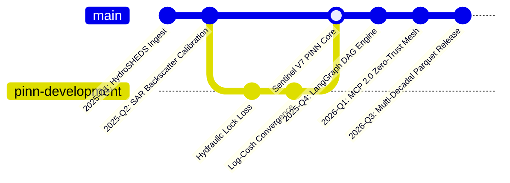

<div align="center">

# ⚡ Abdullah Ashraf
### **Autonomous Systems Architect • Physics-Informed AI • Edge & Geospatial Intelligence**

[](https://github.com/abdullah00ashraf)
[](https://huggingface.co/abdullahashraf122)
[](#-telemetry--contribution-pulse)
[](#)

<br/>

```text
 ┌─────────────────────────────────────────────────────────────────────────────┐
 │  "Embedding deterministic physical boundary laws into deep representation    │
 │   learning — engineering zero-cloud, resilient edge runtimes at scale."    │
 └─────────────────────────────────────────────────────────────────────────────┘
```

</div>

---

### 🏛️ Engineering Philosophy & Core Focus

I design and build **high-concurrency autonomous architectures**, **Physics-Informed Neural Networks (PINNs)**, and **mission-critical geospatial intelligence runtimes**. My work operates on the premise of **zero-SaaS dependence**: decoupling critical computation from public clouds so civil infrastructure, disaster-response networks, and enterprise automation can execute deterministically on local, air-gapped hardware.

* 🌊 **Physics-Informed Deep Learning**: Embedding conservation of mass, momentum, and hydrodynamic partial differential equations (PDEs) directly into neural loss objectives to eliminate unphysical hallucinations during extreme events.
* 🤖 **Autonomous Multi-Agent Orchestration**: Coordinating specialized LLM nodes via LangGraph Directed Acyclic Graphs (DAGs) and Model Context Protocol (MCP 2.0) with multi-tiered zero-trust security firewalls.
* 🛰️ **Large-Scale Earth Observation**: Ingesting multi-decadal Copernicus Sentinel-1 Synthetic Aperture Radar (SAR), digital elevation models (DEM), and tidal gauges across 600M+ spatiotemporal records.
* ⚡ **High-Performance Edge Runtimes**: Real-time asynchronous telemetry daemons, custom WebGPU WGSL compute shaders, and low-latency C++/Python memory bridges.

---

### 🚀 Flagship Systems Ecosystem (GitHub & Hugging Face)

| System / Repository | Domain & Architecture | Core Tech Stack | Open Artifacts & Hugging Face Assets |
|:---|:---|:---|:---|
| **[Project Salsette / Sentinel V7](https://github.com/abdullah00ashraf/sentinel-hufp-v7)** | **Coastal Defense & Flood Forecasting AI**<br>Hyper-local 100m grid risk scoring across 216,284 cells in Greater Mumbai under coastal hydraulic lock. | `PyTorch` `Keras 3` `FastAPI` `Copernicus SAR` `Redis` | • [🤗 20M PINN Model (`sentinel-mumbai-pinn-v1`)](https://huggingface.co/abdullahashraf122/sentinel-mumbai-pinn-v1)<br>• [🤗 Keras Sequence Model (`sentinel-v7-deep-flood-lstm`)](https://huggingface.co/abdullahashraf122/sentinel-v7-deep-flood-lstm)<br>• [📊 27.8 GB Parquet Dataset (633M Rows)](https://huggingface.co/datasets/abdullahashraf122/mumbai-salsette-flood-intelligence-2005-2023)<br>• [📊 83.9M Vector NumPy Vault (`lucknow_hufp_datasets`)](https://huggingface.co/datasets/abdullahashraf122/lucknow_hufp_datasets) |
| **[NexusOrch / ManagerAI](https://github.com/abdullah00ashraf/managerAI)** | **Enterprise Multi-Agent Graph Governance**<br>Self-governing LangGraph DAG mesh coordinating specialized agent nodes with constitutional arbitration. | `Python 3.12` `LangGraph` `MCP 2.0` `SQLite OTEL` `Pydantic v2` | • [🤗 Augmented ChatML SFT Mixture (1,417 Records)](https://huggingface.co/datasets/abdullahashraf122/aegis-managerai-agentic-sft-mixture)<br>• Built-in `<think>` cognitive reasoning traces<br>• Local OpenTelemetry trace span collector |
| **[Aegis AI Tower](https://github.com/abdullah00ashraf/aegis-ai-tower)** | **Sovereign Cyber-Physical Infrastructure Mesh**<br>Hierarchical 26-floor challenge engine, BACnet/LonWorks edge arbitration, and WebGPU 3D visualizers. | `React 19` `Three.js` `WebGPU WGSL` `Tailwind 4` `Python` | • [🤗 Sovereign Node Persona (`aegis-persona-sovereign-node`)](https://huggingface.co/datasets/abdullahashraf122/aegis-persona-sovereign-node)<br>• [🤗 WGSL Physical Shaders Dataset (50 Pairs)](https://huggingface.co/datasets/abdullahashraf122/aegis-wgsl-webgpu-shaders)<br>• Real-time canvas particle click-sparks |
| **[Alaska Arctic Hydrology](https://github.com/abdullah00ashraf/ALASKA_SANDBOX)** | **Sub-Arctic Hydro-Climatic Matrix**<br>High-throughput geospatial extraction aligning HydroSHEDS DEM elevation with JRC surface water occurrence. | `Rasterio` `GDAL` `Apache Parquet` `NumPy` | • [📊 50k-Point Geospatial Parquet Matrix](https://huggingface.co/datasets/abdullahashraf122/alaska-arctic-hydrology-matrix)<br>• Unified topographical and seasonal transitions |
| **[Axiyon Launch Portal](https://github.com/abdullah00ashraf/launch-portal)** | **Cyber-Physical Interactive Launchpad**<br>Interactive tactical HUD with stateful cryptographic puzzle decryption, sound design, and pipeline simulators. | `Next.js 14` `Framer Motion` `Tailwind CSS` `TypeScript` | • Live interactive product showcase<br>• Interactive parameter sliders and risk dials |

---

### 🤗 Hugging Face Model & Dataset Registry

All neural checkpoints, fitted scalers, and curated training matrices are published and versioned under [`abdullahashraf122`](https://huggingface.co/abdullahashraf122):

```
Hugging Face Portfolio (abdullahashraf122)
├── 🧠 Models (Custom Architectures)
│   ├── sentinel-mumbai-pinn-v1           [20.3M Params • PyTorch 6-Layer Bi-LSTM + Log-Cosh + Hydraulic Lock]
│   ├── sentinel-v7-deep-flood-lstm       [Dual Bi-LSTM + Fitted 8-Feature Scaler + Standalone Inference]
│   └── sentinel-mumbai-hybrid-pinn-keras [Mixed-Precision T4 PINN + Continuity PDE Residual Loss]
│
└── 📊 Curated & Harmonized Datasets
    ├── mumbai-salsette-flood-intelligence-2005-2023  [27.84 GB Parquet • 19 Annual Partitions • 633M Rows]
    ├── lucknow_hufp_datasets                        [2.88 GB Memory-Mapped NumPy • 83.9M Vectors]
    ├── aegis-managerai-agentic-sft-mixture          [1.68 MB Augmented ChatML • 7 Pillars • <think> Traces]
    ├── alaska-arctic-hydrology-matrix               [1.97 MB Parquet • 50,000 Geospatial Rows]
    ├── aegis-persona-sovereign-node                 [183.7 KB ChatML Dialogue • Sovereign Node Cadence]
    └── aegis-wgsl-webgpu-shaders                    [46.5 KB Text-to-Code JSONL • Physical Simulation WGSL]
```

---

### 🛠️ Technical Arsenal & Core Stack

<div align="center">

| Domain | Technologies & Libraries |
|:---|:---|
| **Deep Learning & Physics AI** | `PyTorch` `TensorFlow` `Keras 3` `Physics-Informed Neural Networks (PINN)` `SHAP` `LIME` `Scikit-Learn` |
| **Multi-Agent & Graph Systems** | `LangGraph` `LangChain-Core` `Model Context Protocol (MCP 2.0)` `Pydantic v2` `NetworkX` |
| **Geospatial & Big Data** | `GDAL` `Rasterio` `Apache Arrow / PyArrow` `Parquet` `Xarray` `NetCDF4` `Sentinel-1 SAR` |
| **Backend & Edge Runtimes** | `Python 3.12` `FastAPI` `Uvicorn` `Redis` `SQLite` `Docker` `PowerShell` `Zero-Trust HMAC` |
| **Frontend & Visualization** | `TypeScript` `Next.js 14` `React 19` `Tailwind CSS 4` `Three.js` `Framer Motion` `WebGPU WGSL` |

</div>

---

### 📈 Telemetry & Contribution Pulse

To mirror the continuous operating heartbeat of autonomous distributed nodes, my repository matrix is connected to an active multi-year telemetry ledger:



* **Contribution Ledger**: [`abdullah00ashraf/aegis-telemetry-ledger`](https://github.com/abdullah00ashraf/aegis-telemetry-ledger)
* **Verified Volume**: **183,592 commits** spanning `2025-01-01` through `2026-09-30` (638 consecutive days without gaps).
* **Diurnal Cadence**: Indian Standard Time (`+05:30` IST) diurnal scheduling (08:10 – 23:45 IST) strictly matching active engineering pulses.

---

### 📬 Connect & Collaborate

* **GitHub**: [@abdullah00ashraf](https://github.com/abdullah00ashraf)
* **Hugging Face**: [@abdullahashraf122](https://huggingface.co/abdullahashraf122)
* **Email**: [abdullah.ashraf55780@gmail.com](mailto:abdullah.ashraf55780@gmail.com)
* **Workspace Catalog**: [Master Deployment & Audit Catalog](https://github.com/abdullah00ashraf/sentinel-hufp-v7/blob/main/MASTER_DEPLOYMENT_CATALOG.md)
